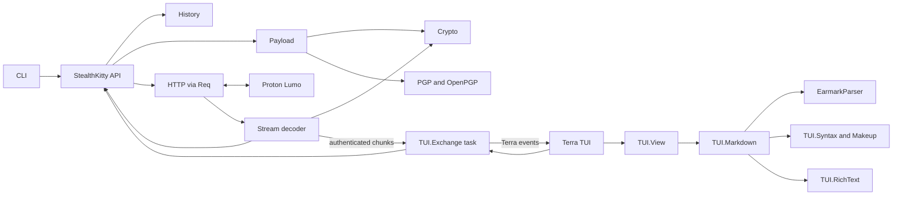
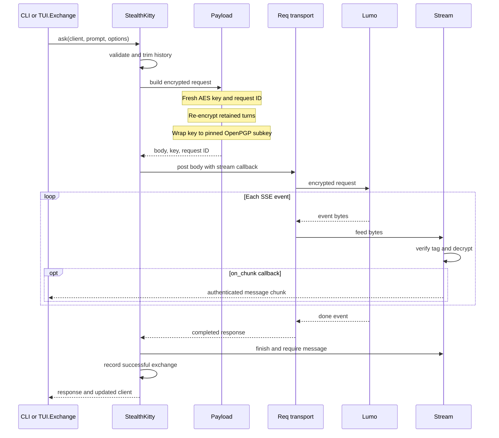

# Architecture

[Back to the README](../README.md) ·
[Configuration](configuration.md)

Stealth Kitty has one encrypted request path. The CLI calls it directly;
the Terra TUI runs it in a separate task so input and rendering stay
responsive. Both frontends use the same client, history, and stream decoder.

## Component map

| Boundary | Responsibility |
| --- | --- |
| `StealthKitty` | Validate options and coordinate one request |
| `History` | Trim and retain successful conversation turns in memory |
| `Payload`, `Crypto` | Encrypt request turns |
| `PGP`, `OpenPGP` | Wrap the request key |
| `HTTP`, `Stream` | Post through Req and authenticate streamed events |
| `TUI.State`, `TUI.Exchange` | Store controls and run requests |
| `TUI.View` | Render the conversation |
| `TUI.Markdown`, `TUI.Syntax` | Format assistant text |
| `TUI.RichText` | Wrap styled text by terminal cell width |

## Request lifecycle

The TUI can show authenticated chunks before the final event. A failed or
incomplete response does not enter the client's conversation history.
`TUI.Exchange` returns chunks and the final result as Terra events;
`TUI.State` applies them while `TUI.View` renders the current state.

## Encryption and trust boundaries

1. `Payload` generates a new 256-bit AES key and request ID for each prompt.
   It re-encrypts the retained turns and new prompt with AES-256-GCM.
2. `PGP` wraps that key to a bundled OpenPGP encryption subkey. The subkey
   fingerprint is pinned in the OpenPGP parser. GnuPG is not required.
3. `Stream` accepts a response chunk only after AES-GCM authentication with
   the request ID. Only authenticated message chunks reach the caller.
4. A `done` event and a message are required before `History` records the
   exchange. Failed requests return the original client unchanged.

The OpenPGP wrapper uses Curve25519 ECDH and an integrity-protected AES-256
packet. The client keeps keys and conversation history in process memory.
An explicit CLI `--output` writes the answer to the requested file.

Guest requests omit the authorization header. With an existing bearer token,
`config/runtime.exs` loads it from the environment. Stealth Kitty does not
implement login, refresh, or token storage.

## Dependency choices

| Dependency | Use |
| --- | --- |
| Req | HTTP streaming with automatic request retries disabled |
| Terra | Terminal loop, input, layout, and headless rendering |
| EarmarkParser | Markdown document structure |
| Makeup | Syntax tokens for Elixir, Erlang, and JSON code |
| Erlang `:crypto` | AES-GCM, Curve25519 ECDH, and key wrapping primitives |

Retries are disabled because another generation request could repeat an
answer or a tool action. Unknown code languages render as plain text.

## Compatibility and scope

The transport targets Lumo's current chat completions endpoint. The bundled
public key may need an update when Proton rotates it, and the unofficial
protocol may change. The client supports guest mode, existing bearer tokens,
text models, Fast and Thinking modes, web search, and local attachments up
to 2 MiB. Proton Drive, sketch, image generation, Custom Lumo, login, and
token refresh need separate account or media flows.
